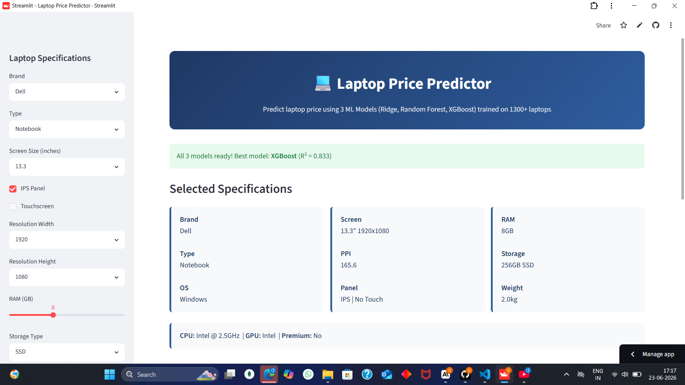
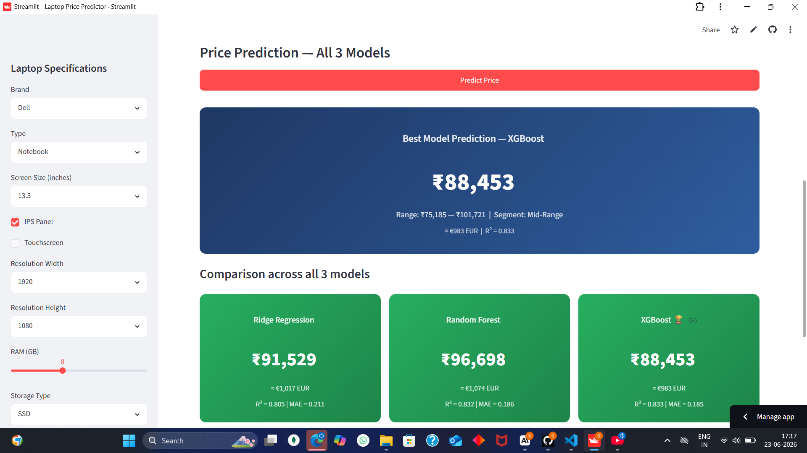

# 💻 Laptop Price Predictor

A machine learning regression project that predicts laptop prices based on hardware specifications — RAM, CPU, GPU, storage, screen, brand, and more. Built as part of an ML coursework assignment covering the full pipeline: EDA → cleaning → feature engineering → preprocessing → model training → evaluation → deployment.

**🔗 Live App:** [https://laptop-price-predictor-emazcbznuo69tzqsbqfbnu.streamlit.app/](https://laptop-price-predictor-emazcbznuo69tzqsbqfbnu.streamlit.app/)

---

## 📌 Problem Statement

Predict the price (in EUR, displayed in INR) of a laptop given its specifications, using supervised regression. This helps buyers estimate fair market value and helps sellers/retailers benchmark pricing against hardware configuration.

- **Type:** Regression
- **Target variable:** `Price_euros` (log-transformed during training as `log_price`)
- **Dataset:** [Laptop Price Dataset (Kaggle)](https://www.kaggle.com/datasets/muhammetvarl/laptop-price) — ~1300 rows, 13 raw columns

---

## 🗂️ Project Structure

```
laptop-price-predictor/
├── data/
│   └── laptop_price_featured.csv   # Feature-engineered dataset used by the app
├── models/
│   ├── model.pkl                   # Serialized best model (XGBoost)
│   ├── preprocessor.pkl             # Serialized preprocessing pipeline
│   ├── feature_selector.pkl
│   └── metadata.json
├── notebooks/
│   ├── Step2_EDA_Laptop_Price.ipynb
│   ├── Step3_Data_Cleaning_Laptop_Price.ipynb
│   ├── Step4_Feature_Engineering_Laptop_Price.ipynb
│   ├── Step5_Preprocessing_Laptop_Price.ipynb
│   ├── Step6_Model_Training_Laptop_Price.ipynb
│   ├── Step7_Model_Evaluation_Laptop_Price.ipynb
│   └── Step8_Model_Serialization_Laptop_Price.ipynb
├── src/                             # Reserved for reusable source modules
├── lapapp.py                        # Streamlit app (entry point — trains models on startup)
├── requirements.txt                 # Python dependencies
├── README.md                        # This file
└── report.pdf                       # Full project report
```

> **Note:** The deployed app (`lapapp.py`) retrains all 3 models fresh on every cold start directly from `data/laptop_price_featured.csv`. This avoids pickle/joblib version-mismatch issues between the training environment (Colab) and the deployment environment (Streamlit Cloud), at the cost of a ~30–45 second first load. Serialized `model.pkl` / `preprocessor.pkl` are still included in `models/` as required deliverables.

---

## 🔬 Methodology

### 1. Data Cleaning
Raw columns like `Ram` (`"8GB"`), `Weight` (`"1.37kg"`), `ScreenResolution`, `Cpu`, `Gpu`, and `Memory` were parsed from free text into structured numeric/categorical fields.

### 2. Feature Engineering
| Feature | Description |
|---|---|
| `ppi` | Pixel density — display sharpness |
| `is_ips`, `is_touchscreen` | Binary display flags |
| `cpu_brand`, `cpu_ghz`, `cpu_perf_score` | Parsed CPU identity + performance proxy |
| `gpu_brand` | Parsed GPU manufacturer |
| `storage_type`, `storage_gb`, `storage_tier` | Parsed and tiered storage |
| `ram_tier`, `weight_category` | Binned market segments |
| `is_premium` | Composite flag from brand, type, RAM, and storage |
| `log_price` | Log-transformed target to correct right-skew |

### 3. Preprocessing Pipeline
- Numerical features → median imputation + standard scaling
- Categorical features → mode imputation + one-hot encoding
- Binary features → passthrough
- `SelectKBest` (f_regression) → top 20 features
- 80/20 train-test split, `random_state=42`

### 4. Models Trained
Three models were trained and compared, satisfying the "train at least 3 models" requirement:

| Model | Why it was chosen |
|---|---|
| **Ridge Regression** | Linear baseline with L2 regularization; handles multicollinearity from one-hot encoded features |
| **Random Forest** | Captures non-linear relationships and feature interactions; robust to outliers |
| **XGBoost** | Gradient boosting with L1+L2 regularization; typically strongest on structured/tabular data |

The app evaluates all three on the test set (R², MAE) and highlights the best performer, while still showing all three predictions side by side for comparison.

### 5. Evaluation Metrics
- **R²** (coefficient of determination)
- **MAE** (Mean Absolute Error, log scale)
- **RMSE**, **MAPE** (see `Step7_Model_Evaluation.ipynb` for full breakdown)

---

## 🚀 Running Locally

```bash
git clone https://github.com/Shivakumar391-ux/laptop-price-predictor.git
cd laptop-price-predictor
pip install -r requirements.txt
streamlit run lapapp.py
```

The app will train Ridge, Random Forest, and XGBoost on first launch (~30–45 sec), then cache them for the session.

---

## 🌐 Deployment

Deployed on **Streamlit Community Cloud**, connected directly to this GitHub repository (`main` branch, entry file `lapapp.py`).

---

## 🛠️ Tech Stack

- **Language:** Python 3.12
- **ML:** scikit-learn, XGBoost
- **App:** Streamlit
- **Data:** pandas, numpy
- **Visualization (notebooks):** matplotlib, seaborn

---

## 📸 Screenshots


**Sidebar — Specification Input Form**


**Prediction Output — All 3 Models Compared**


---

## 📄 License

Built for academic coursework purposes.
